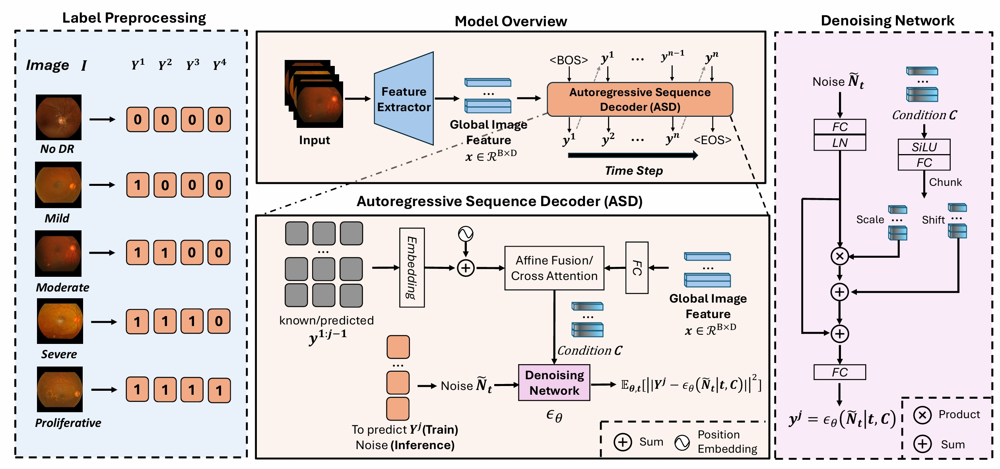

# AOR-DR
Parameterized Diffusion Optimization enabled Autoregressive Ordinal Regression for Diabetic Retinopathy Grading (MICCAI 2025 oral).

> [!IMPORTANT]
> This repository contains the original **AOR-DR conference version** (MICCAI 2025).
> Our **journal version** is **[DiffGeo-AOR](https://github.com/Qinkaiyu/DiffGeo-AOR)**.
>  The journal version provides more stable performance, faster convergence, a more systematic codebase, and support for both 2D and 3D medical images.
> For new experiments and practical usage, please use the journal version directly.
## Introduction
As a long-term complication of diabetes, diabetic retinopathy (DR) progresses slowly, potentially taking years to threaten vision. An accurate and robust evaluation of its severity is vital to ensure prompt management and care. Ordinal regression leverages the underlying inherent order between categories to achieve superior performance beyond traditional classification. However, there exist challenges leading to lower DR classification performance: 1) The uneven distribution of DR severity levels, characterized by a long-tailed pattern, adds complexity to the grading process. 2)The ambiguity in defining category boundaries introduces additional challenges, making the classification process more complex and prone to inconsistencies. This work proposes a novel autoregressive ordinal regression method called AOR-DR to address the above challenges by leveraging the clinical knowledge of inherent ordinal information in DR grading dataset settings. Specifically, we decompose the DR grading task into a series of ordered steps by fusing the prediction of the previous steps with extracted image features as conditions for the current prediction step. Additionally, we exploit the diffusion process to facilitate conditional probability modeling, enabling the direct use of continuous global image features for autoregression without relearning contextual information from patch-level features. This ensures the effectiveness of the autoregressive process and leverages the capabilities of pre-trained large-scale foundation models. Extensive experiments were conducted on four large-scale publicly available color fundus datasets, demonstrating our model's effectiveness and superior performance over six recent state-of-the-art ordinal regression methods.

<p align="center">
  
</p>

### Datasets 
Data can be obtained from [here](https://github.com/chehx/DGDR/blob/main/GDRBench/README.md).

Your dataset should be organized as: 

```
.
├── images
│   ├── DATASET
│   │   ├── mild_npdr
│   │   ├── moderate_npdr
│   │   ├── nodr
│   │   ├── pdr
│   │   └── severe_npdr
│   ├── DATASET2
│   │   ├── mild_npdr
│   │   ├── moderate_npdr
│   │   ├── nodr
│   │   ├── pdr
│   │   └── severe_npdr
│   ├── DATASET3
│   │    ...
│   ...  ...
│  
│   
└── splits
    ├── target_DATA(need change)_train.txt
    ├── DATA(need change)_crossval.txt
    ...

```
### train
``` bash
python main.py
```

### test
``` bash
python test.py
```
### checkpoint
[link](https://drive.google.com/drive/folders/1AFiUMh3WB53XOMwYVm-2_6ooOcram77l?usp=sharing)
